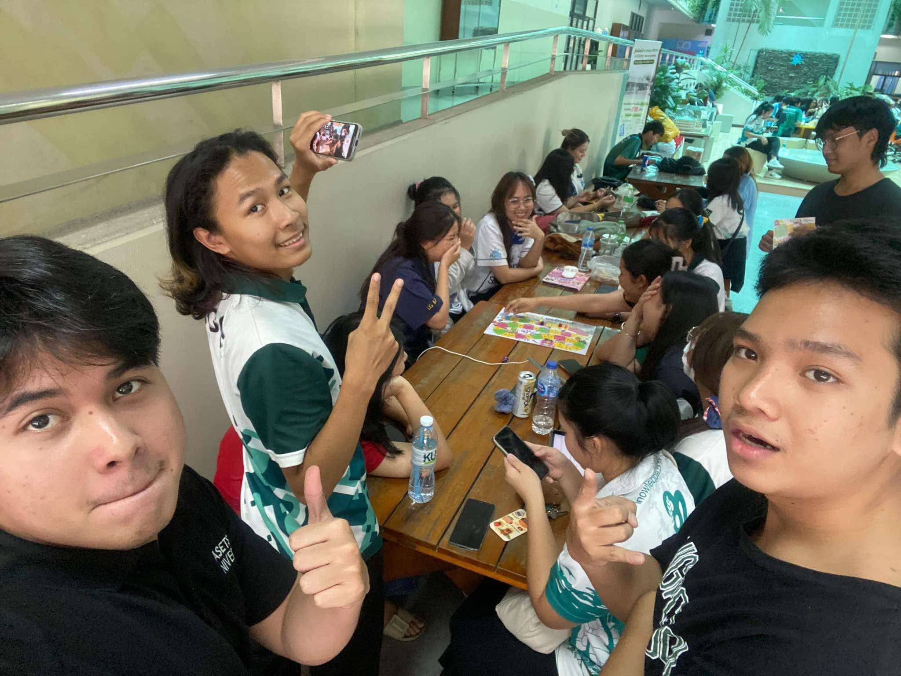
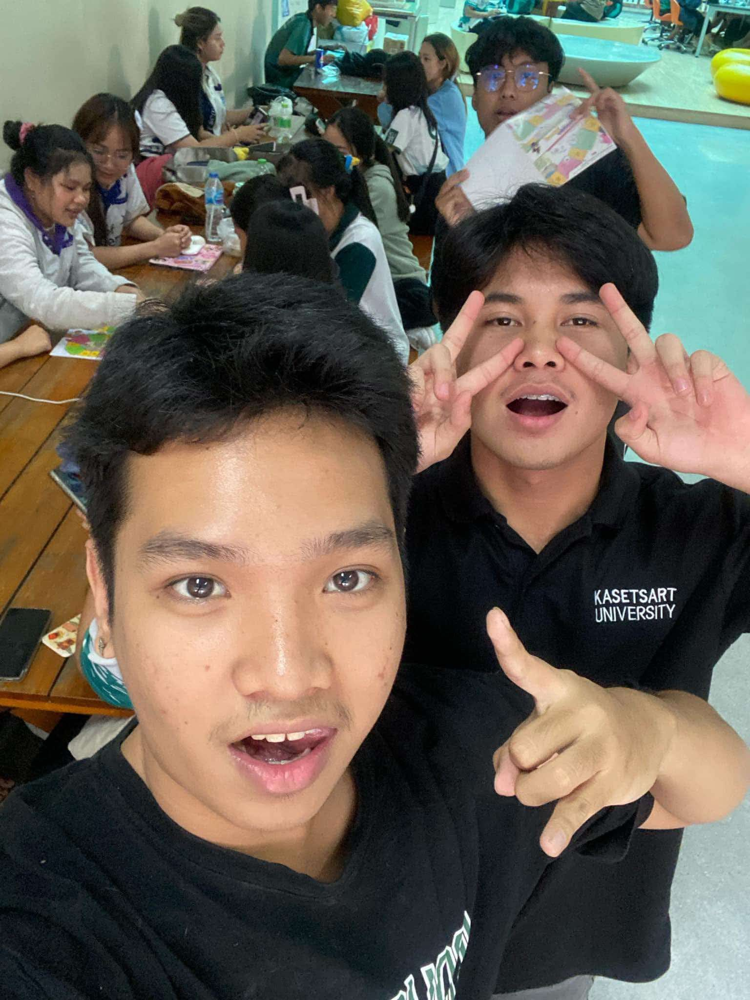
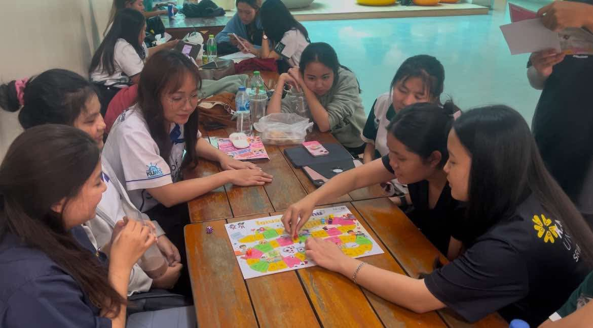
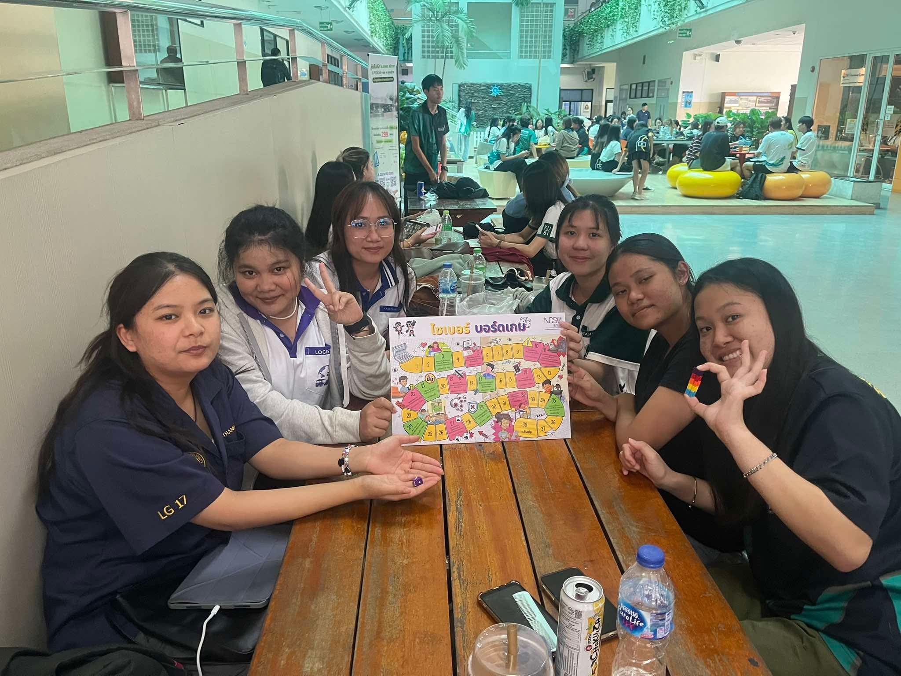

# **🌐 Securing the Human**  
### **👥 กลุ่ม: Seksan-Salahsakul**  
---

## **✨ ภาพกิจกรรม**  
### 📸 **ภาพกิจกรรมที่ 1**  
  
### 📸 **ภาพกิจกรรมที่ 2**  
  
### 📸 **ภาพกิจกรรมที่ 3**  
  
### 📸 **ภาพกิจกรรมที่ 4**  
  

🎲 **กิจกรรม**นี้จัดทำโดยกลุ่ม **"Seksan-Salahsakul"** ซึ่งเป็นนิสิตสาขาวิทยาการคอมพิวเตอร์ (Computer Science)  
🕹️ จัดกิจกรรม "เล่น Boardgame Cyber จาก NCSA" เพื่อ **สร้างความตระหนักรู้ในโลกไซเบอร์**  

👨‍🎓 กลุ่มตัวอย่าง: **นิสิตคณะวิทยาการจัดการ สาขาการจัดการโลจิสติกส์ ชั้นปีที่ 3 จำนวน 6 คน**  
📋 **หมายเหตุ**: การบันทึกภาพและวิดีโอของกิจกรรมครั้งนี้ได้ดำเนินการขออนุญาตจากผู้เข้าร่วมเรียบร้อยแล้ว  

---

## **📅 วันที่และสถานที่จัดกิจกรรม**  
📆 **วันจันทร์ที่ 21 มกราคม 2025**  
📍 **ตึก 10 มหาวิทยาลัยเกษตรศาสตร์ วิทยาเขตศรีราชา**  

---

## **📖 สิ่งที่ได้รับจาก Boardgame นี้**  
1. 🎉 **ความสนุกสนาน**: สร้างบรรยากาศที่ผ่อนคลายและเพลิดเพลิน  
2. 👁️‍🗨️ **พักสายตา**: ลดการใช้อุปกรณ์หน้าจอและเทคโนโลยีในช่วงเวลาหนึ่ง  
3. 💬 **แลกเปลี่ยนความคิดเห็น**: เปิดโอกาสให้ทุกคนได้พูดคุยและแสดงความคิดเห็นเกี่ยวกับปัญหาโลกไซเบอร์  
4. 🚨 **ความตระหนักรู้**: เข้าใจถึงความเสี่ยงและการป้องกันตัวเองในโลกไซเบอร์มากขึ้น  

---

## **🌟 ภาพรวมของกิจกรรม**  
### 🖼️ **ภาพรวมหลังจบกิจกรรม**  
  

### 🎥 **วิดีโอกิจกรรม**  
[📹 ชมวิดีโอกิจกรรม](https://youtu.be/jQjWgcT8QnA?si=njWl4ED7XrX26aYa)  

---

## **👥 สมาชิกในกลุ่ม Seksan-Salahsakul**  
1. ⭐ **Tante Wanitchakorn** → [Github Page](https://huggies2003.github.io/Boardgame)  
2. ⭐ **Poramet Obyam**  → [Github Page](https://poramet04.github.io/Boardgame)
3. ⭐ **Vorapol Boonrasri** → [Github Page](https://Vorxp.github.io/boardgame)  
4. ⭐ **Wasawat Boonporn**  → [Github Page](https://isnname.github.io/boardgame)

---

