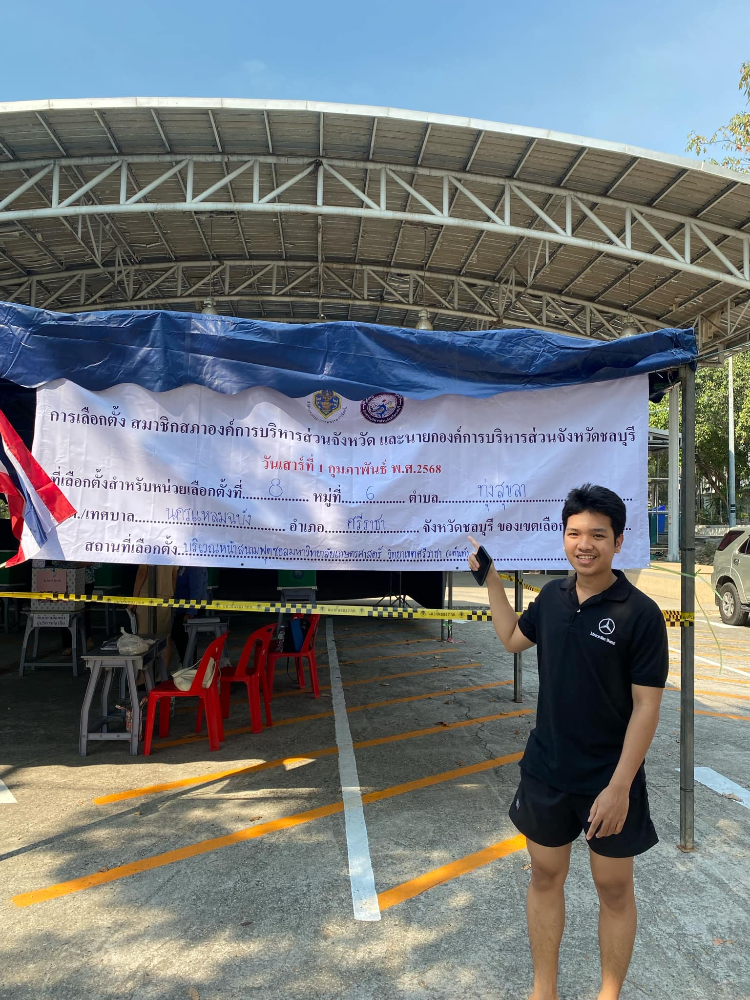

# 🗳️ 2025 PAO Elections - Chonburi  
การเลือกตั้งสมาชิกสภาองค์การบริหารส่วนจังหวัด และนายกองค์การบริหารส่วนจังหวัดชลบุรี  

📅 **วันเลือกตั้ง:** วันเสาร์ที่ 1 กุมภาพันธ์ พ.ศ. 2568  
📍 **สถานที่เลือกตั้ง:** หน่วยเลือกตั้งในจังหวัดชลบุรี  

---

## 📌 Check-in กิจกรรมเลือกตั้ง  
  

---

## 🏛️ เกี่ยวกับการเลือกตั้ง  
การเลือกตั้งครั้งนี้เป็นการเลือกตั้งสมาชิกสภาองค์การบริหารส่วนจังหวัด (อบจ.) และนายกองค์การบริหารส่วนจังหวัด ซึ่งเป็นหน่วยงานปกครองส่วนท้องถิ่นที่มีบทบาทสำคัญในการพัฒนาพื้นที่และดูแลประชาชนในจังหวัดชลบุรี  

### ✨ วัตถุประสงค์ของการเลือกตั้ง  
- เลือกตั้งผู้แทนประชาชนระดับจังหวัดเพื่อกำหนดทิศทางการพัฒนาท้องถิ่น  
- ส่งเสริมประชาธิปไตยและการมีส่วนร่วมของประชาชน  
- คัดเลือกผู้นำที่มีความสามารถในการบริหารงบประมาณและพัฒนาชุมชน  

---
