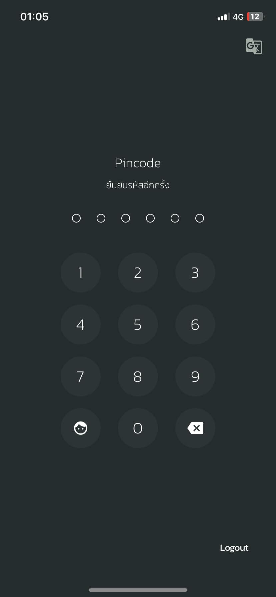

# 🔐 Security Control: Bitkub App

## 📄 รายละเอียด
Bitkub เป็นแพลตฟอร์มซื้อขายสกุลเงินดิจิทัลที่ได้รับความนิยมในประเทศไทย ซึ่งมีระบบรักษาความปลอดภัยที่เข้มงวดเพื่อป้องกันการเข้าถึงบัญชีโดยไม่ได้รับอนุญาต และเพิ่มความมั่นใจให้กับผู้ใช้งาน

---

## 📋 การจัดประเภท
- **Control Function:** Preventative
- **Type of Security Control:** Logical Controls

---

## 🛡️ เหตุผล
Bitkub App ถูกจัดเป็น **Logical Control** เนื่องจากใช้ซอฟต์แวร์และเทคโนโลยีเพื่อรักษาความปลอดภัยของบัญชีผู้ใช้ และเป็น **Preventative Control** เพราะมีมาตรการป้องกันการโจมตีทางไซเบอร์ เช่น การยืนยันตัวตนแบบสองขั้นตอน (**2FA**) และระบบตรวจสอบธุรกรรมที่ผิดปกติ

---

## 💡 ตัวอย่างการใช้งาน
✅ ใช้ 2FA เพื่อเพิ่มความปลอดภัยในการเข้าสู่ระบบ  
✅ ตรวจสอบธุรกรรมและแจ้งเตือนความผิดปกติผ่านอีเมลหรือ SMS  
✅ ใช้มาตรฐานความปลอดภัยระดับสูงในการปกป้องข้อมูลของผู้ใช้  

---

## 🛠️ วิธีการเพิ่มความปลอดภัยใน Bitkub App
### 1️⃣ ติดตั้งแอปพลิเคชัน
ดาวน์โหลด Bitkub ได้จาก:
- [📲 Google Play Store (Android)](https://play.google.com/store/apps/details?id=com.bitkub)
- [📲 App Store (iOS)](https://apps.apple.com/th/app/bitkub/id1445907787)

### 2️⃣ เปิดใช้งาน 2FA บนบัญชีของคุณ
1. ไปที่ **การตั้งค่าความปลอดภัย** ในแอป Bitkub
2. เปิดใช้งาน **Two-Factor Authentication (2FA)**
3. ใช้ Google Authenticator หรือแอปที่รองรับในการสแกน QR Code
4. ป้อนรหัส OTP ที่แอปสร้างขึ้นเพื่อยืนยันการตั้งค่า

### 3️⃣ ใช้มาตรการรักษาความปลอดภัยเพิ่มเติม
- ตั้งรหัส PIN สำหรับการทำธุรกรรม
- เปิดใช้งานแจ้งเตือนทุกครั้งที่มีการเข้าสู่ระบบจากอุปกรณ์ใหม่
- หลีกเลี่ยงการใช้เครือข่ายสาธารณะในการเข้าสู่ระบบ

---
# 🚀 ข้อดีของ Bitkub App
| 🛡️ **ข้อดี** | 🔍 **รายละเอียด** |
|-------------|----------------|
| 🔥 **ปลอดภัยสูง** | รองรับ 2FA และการยืนยันตัวตนหลายขั้นตอน |
| 📊 **เข้าถึงตลาดคริปโตได้ง่าย** | ซื้อขายสกุลเงินดิจิทัลได้สะดวกและรวดเร็ว |
| 🔍 **ตรวจสอบธุรกรรมแบบเรียลไทม์** | แจ้งเตือนทุกการเคลื่อนไหวของบัญชี |
| 🌍 **รองรับการใช้งานทั่วโลก** | ใช้งานได้ทั้งในประเทศไทยและต่างประเทศ |

---
